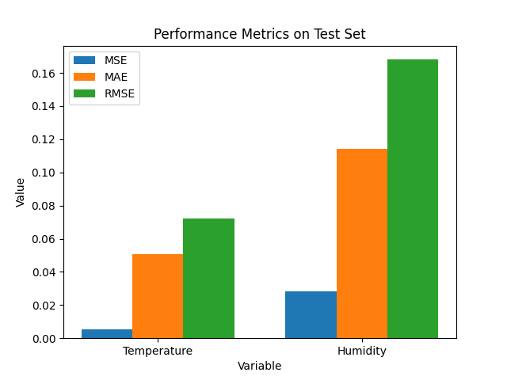

# Raspberry Pi Sensor Data Forecasting with LSTM

## 📌 Problem Statement

**Goal:** To forecast temperature and humidity using time series data collected from a Raspberry Pi's environmental sensor, leveraging an LSTM neural network for accurate predictions.

Environmental monitoring is crucial for smart home automation, agriculture, and research. This project demonstrates an end-to-end pipeline for collecting, cleaning, analyzing, and forecasting sensor data using deep learning.

---

## 🚀 Project Intent

- **Collect** real-world sensor data from a Raspberry Pi (DHT22 or similar sensor)
- **Store** the data in InfluxDB for efficient time series management
- **Analyze** and visualize trends in temperature and humidity
- **Forecast** future values using an LSTM neural network
- **Evaluate** model performance with standard metrics

---

## 🗂️ Workflow Overview

1. **Data Ingestion**
    - Data is pulled from InfluxDB (replace with your own credentials and IP address).
    - **Sensitive details (host, username, password) are hidden in this repository.**
    - The public pipeline uses dummy data by default for safety.

2. **Data Cleaning & Preprocessing**
    - Convert timestamps and set as index
    - Resample to 1-minute intervals
    - Interpolate missing values
    - Remove outliers based on sensor limits

3. **Exploratory Data Analysis (EDA)**
    - Visualize temperature and humidity trends over time
    - Example plot:

      

4. **Modeling with LSTM**
    - Data is scaled and split chronologically (70% train, 15% val, 15% test)
    - LSTM model is trained to predict the next time step for both temperature and humidity
    - Early stopping is used to prevent overfitting

5. **Results & Evaluation**
    - Actual vs. predicted plots for both variables:

      
      
    - Training vs. validation loss:

      
    - Bar chart of MSE, MAE, RMSE for both variables:

      

---

## 🏆 Key Metrics (Test Set)

| Metric | Temperature | Humidity |
|--------|-------------|----------|
| MSE    | *(see metrics_bar.png)* | *(see metrics_bar.png)* |
| MAE    | *(see metrics_bar.png)* | *(see metrics_bar.png)* |
| RMSE   | *(see metrics_bar.png)* | *(see metrics_bar.png)* |

> **See `assets/metrics_bar.png` for the exact values.**

---

## 🛡️ Sensitive Information

- All sensitive details (database host, username, password) are omitted from this repository. Please use your own secure credentials in the pipeline if connecting to InfluxDB.

---

## 📝 Suggestions for Improvement

To make this project a more robust, end-to-end data science project for your GitHub repo:

1. **Data Pipeline**
   - Automate data ingestion and cleaning with modular scripts or functions
   - Add data versioning (e.g., DVC)
2. **Exploratory Data Analysis**
   - Add more statistical summaries and anomaly detection
   - Visualize seasonality and trends
3. **Feature Engineering**
   - Add lag features, rolling statistics, or external weather data
4. **Modeling**
   - Compare LSTM with classical models (ARIMA, Prophet)
   - Hyperparameter tuning (e.g., with Optuna)
   - Add model explainability (SHAP, feature importance)
5. **Evaluation**
   - Use additional metrics (MAPE, R2)
   - Cross-validation for time series
6. **Deployment**
   - Export model for real-time inference on Raspberry Pi
   - Build a simple dashboard (Streamlit, Dash) for live monitoring
7. **Documentation & Reproducibility**
   - Add environment setup instructions (requirements.txt, environment.yml)
   - Provide sample data (with sensitive info removed)
   - Add unit tests for data and model functions

---

## 📂 Repository Structure

```
pi_ml/
  ├── pi_ml_pipeline copy.py  # Public pipeline (safe for GitHub)
  ├── README.md
  ├── assets/
  │     ├── banner.png
  │     ├── eda_plot.png
  │     ├── temp_pred.png
  │     ├── hum_pred.png
  │     ├── loss_plot.png
  │     └── metrics_bar.png
  ├── requirements.txt
  └── ...
```

---

## 📸 How to Add Plots/Images

1. Save your matplotlib plots using `plt.savefig('assets/plot_name.png')` in the pipeline.
2. Place the images in the `assets/` folder.
3. Update the README image links if you change filenames.

---

## 🤝 Contributions

Pull requests and suggestions are welcome! Please ensure no sensitive data is included in your contributions.

---

## 📧 Contact

For questions, open an issue or contact the repo maintainer. 
